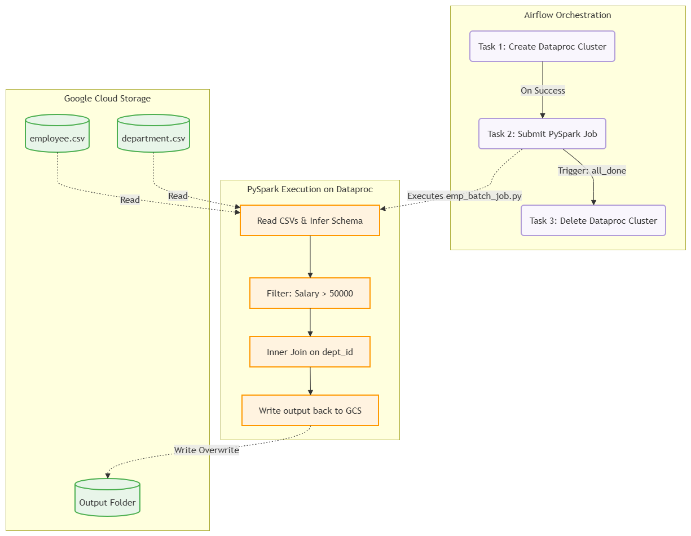
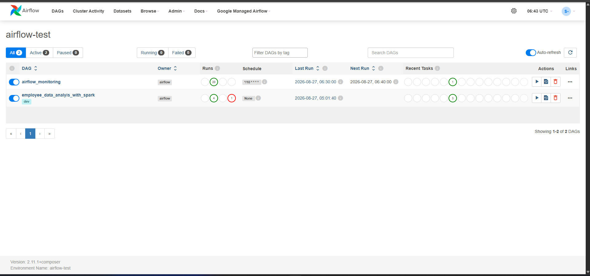
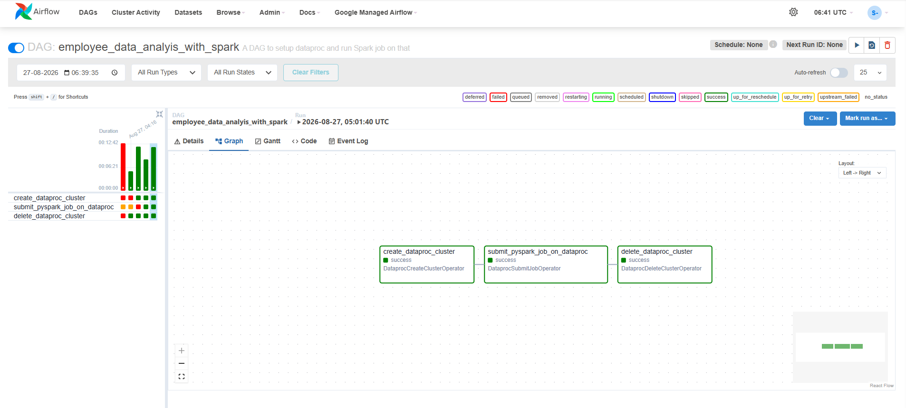
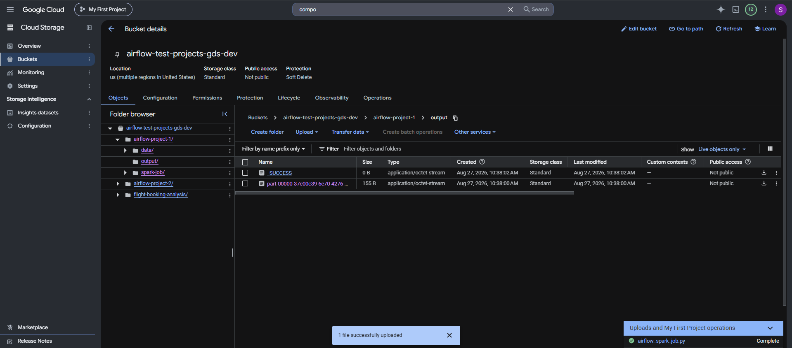

# GCP Airflow & PySpark ETL Pipeline

This repository contains an automated Data Engineering pipeline orchestrated by Apache Airflow (Google Cloud Composer). The pipeline provisions an ephemeral Dataproc cluster, executes a distributed PySpark batch job to process and join datasets stored in Google Cloud Storage (GCS), and cleanly tears down the cluster upon completion to optimize cloud computing costs.

## 🏗️ Architecture & Pipeline Flow

The ETL process is fully automated and consists of three distinct lifecycle stages:
1. **Provision Infrastructure:** Airflow dynamically spins up a Dataproc cluster configured with 1 Master and 2 Worker nodes.
2. **Execute Transformation:** A PySpark job is submitted to the cluster. It reads raw employee and department CSVs from GCS, filters for salaries above 50,000, performs an inner join on `dept_id`, and writes the results back to GCS.
3. **Decommission:** Airflow destroys the cluster immediately after the job finishes (or fails) to prevent idle cloud billing.

**Architecture Flowchart:**
*(Export your Draw.io diagram as a PNG, place it in `02_Architecture`, and replace the link below)*

## 📁 Repository Structure

The project follows a standard data engineering layout:
*   **`01_Docs/`**: Contains line-by-line explanations of the PySpark and Airflow code.
*   **`02_Architecture/`**: Stores pipeline diagrams and flowcharts.
*   **`03_Recordings/`**: Local execution recordings (Excluded from Git tracking).
*   **`04_Assets/`**: Contains the source code (`airflow_spark_job.py`, `emp_batch_job.py`) and source data (`employee.csv`, `department.csv`).

## 🚀 Step-by-Step Deployment

**GCP Prerequisites & Permissions:**
*   A GCP Project with active billing.
*   Enable the following APIs: Cloud Composer, Cloud Dataproc, and Cloud Storage.
*   Grant your Compute Engine default service account the following IAM roles: `Composer Worker`, `Dataproc Worker`, and `Service Account User`.

**Deployment Execution:**
*   Create a GCS bucket to hold your project assets (e.g., `gs://your-bucket-name/`).
*   Upload the raw data (`employee.csv`, `department.csv`) to your GCS data path.
*   Upload the transformation logic (`emp_batch_job.py`) to your GCS scripts path.
*   Upload the orchestration DAG (`airflow_spark_job.py`) directly to the `dags/` folder inside your Cloud Composer environment bucket.

## 📊 Execution & Results

Once deployed, the pipeline can be triggered directly from the Airflow Web UI. 

**1. DAG Graph Execution:**
*(Insert your screenshot of the Airflow Graph view showing the three tasks)*

**2. Successful Run:**
*(Insert your screenshot showing the DAG tasks completely green/successful)*

**3. Final Output:**
*(Insert your screenshot of the GCS bucket showing the `_SUCCESS` file and final CSV)*
